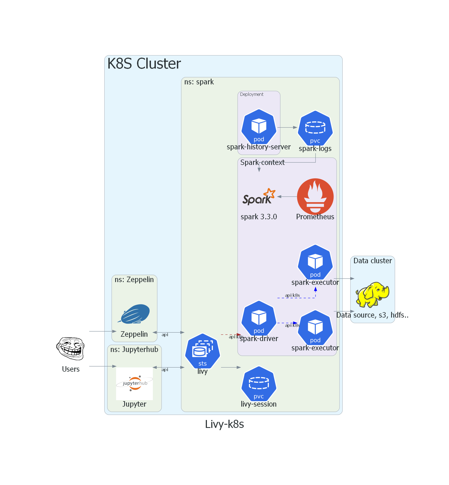
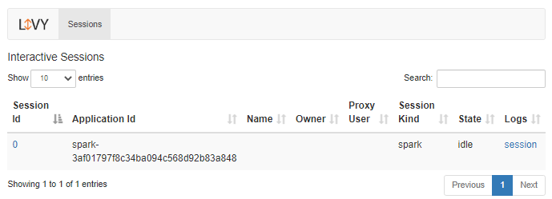
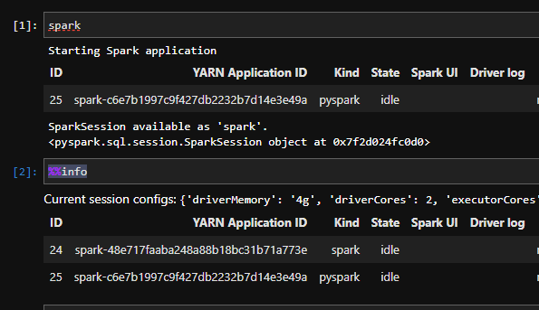

# Apache Livy for k8s spark 3.3.0

I used a fork of the project https://github.com/apache/incubator-livy (include PR: https://github.com/apache/incubator-livy/pull/249/files)

And also some of the ideas of the guys from the project https://github.com/HPEEzmeral/spark-on-k8s

In the current project, I added a Dokerfile to build livy, spark, as well as helm chart to run in the k8s environment

The scheme of work is similar to the scheme in the Hadoop cluster:



## Building Livy

To build, it is enough to build the Dockerfile in the root of the project.
```
docker build -t livy .
```

## Install Livy

You need to create a Namespace spark in the l8y cluster

```
kubectl create ns spark
```

Then install helm chart:
```
cd helm/
helm upgrade --install livy . -n spark
```


## Example
After the pod is launched. It is necessary to organize access to port 8998. It does not matter how it will be done, through the forwarding port or intgerss.

You can also use the provided [Dockerfile](./dev/docker/livy-dev-base/Dockerfile):


To start a session, you need to send a POST request http://localhost:8998/sessions.
```

# Example
{"kind": "spark" , "driverMemory": "8g",    "driverCores": 4,    "executorMemory": "4g",     "executorCores": 1,     "numExecutors": 10}

git clone https://github.com/apache/incubator-livy.git
cd incubator-livy
docker build -t livy-ci dev/docker/livy-dev-base/
docker run --rm -it -v $(pwd):/workspace -v $HOME/.m2:/root/.m2 livy-ci mvn package

```


Next you will see the formation of spark pods:


## Jupyter

To work from Jupyter, you need to create kernels (https://github.com/jupyter-incubator/sparkmagic)



## This scheme of work is at the testing stage, I am not yet sure about its advantages!

The Livy package itself does not contain a Spark distribution. It will work with any supported
version of Spark without needing to rebuild.

### Build Profiles

| Flag         | Purpose                                                            |
|--------------|--------------------------------------------------------------------|
| -Phadoop2    | Choose Hadoop2 based build dependencies (default configuration)    |
| -Pspark2     | Choose Spark 2.x based build dependencies (default configuration)  |
| -Pspark3     | Choose Spark 3.x based build dependencies                          |
| -Pscala-2.11 | Choose Scala 2.11 based build dependencies (default configuration) |        
| -Pscala-2.12 | Choose scala 2.12 based build dependencies                         |

